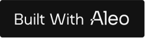

# 🌪️ ZLEND — Lend & Borrow in Full Privacy 🕵️‍♂️

> **Private. Powerful. Trustless. Welcome to the future of DeFi on [Aleo](https://aleo.org).**

[➡️ Live Demo](https://zlend.vercel.app/)

---

## ✨ What is zlend?

**zlend** is a next-gen decentralized **peer-to-peer** protocol for **lending** and **borrowing** — fully **private** by design, and powered by **zero-knowledge proofs**.

---

## 💥 Start Lending & Borrowing

  

[➡️ Get Started Now](https://zlend.vercel.app/)

---

## 🚀 Core Advantages

| 🔒 Private by Design | 🔗 Trustless Security | ✨ Powerful UX |
|---------------------|-----------------------|----------------|
| All transactions are protected by **zero-knowledge proofs**. Your activity is **yours** — always. | Logic is enforced by **smart contracts** — no intermediaries, no counterparty risk. | Designed for both **DeFi pros** and **newcomers** — smooth, sleek, and intuitive. |

---

## ❓ Frequently Asked Questions

  
🤔 What is zlend?

  
ZLEND is a decentralized protocol enabling <strong>private lending and borrowing</strong> via zero-knowledge technology.

  
💸 How does lending and borrowing work?

  
Supply crypto as collateral and borrow against it. <strong>Everything is private</strong>, secured by smart contracts.

  
🪙 What assets can I use?

  
ZLEND currently supports <strong>ETH</strong>, <strong>USDC</strong>, and <strong>Aleo</strong>.

  
🚀 How do I start?

  
Connect your wallet, deposit assets, and you're good to go with <strong>full privacy</strong>.

➡️ [See More FAQs](https://zlend.vercel.app/#faq)

---

## 🧬 Built With Aleo

zlend is proudly **powered by Aleo** — a zero-knowledge L1 blockchain that brings privacy and programmability together.

[🔍 Learn more about Aleo](https://www.aleo.org)

---

## 🏗️ Tech Stack

- 🔐 **Zero-Knowledge Proofs (ZKPs)**
- 🧠 **Aleo Blockchain**
- 🦾 **Smart Contracts**
- 🧭 **Intuitive dApp Interface**

---

## 🤝 Powered by & in Partnership With

  

  <a href="https://zlend.vercel.app"><strong>zlend</strong></a> is proudly built on <a href="https://aleo.org"><strong>Aleo</strong></a> and developed in partnership with <a href="https://zsociety.io"><strong>zSociety</strong></a>.

  
  &nbsp;&nbsp;&nbsp;
  

---

> _"zlend isn't just private DeFi — it's a movement towards a **trustless**, **secure**, and **user-first** financial future."_ ✨

  
  
  

